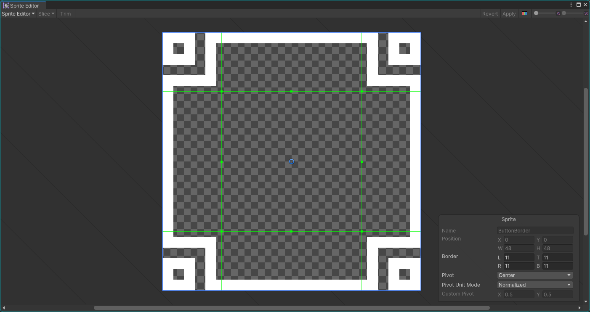
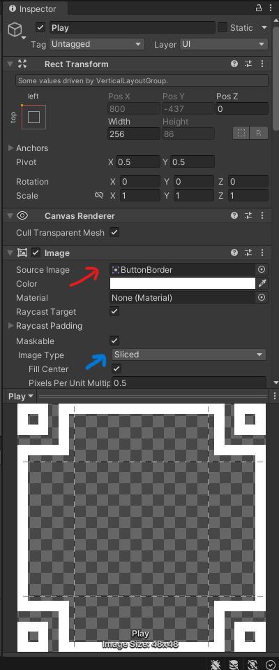
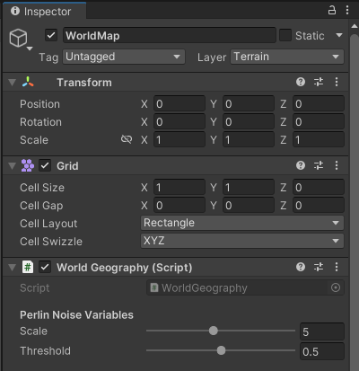
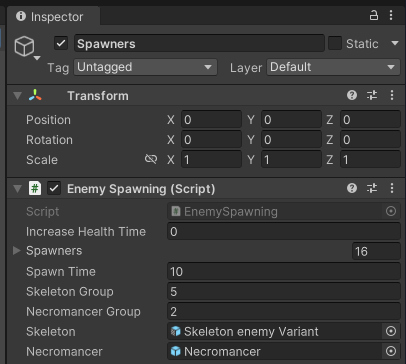

# Instructions

Want to modify the game? Don't worry, we'll help guide you through what you
need to do in order to get the game looking the way you want it to!

Since changing the game in its entirety is very complex, we'll only cover the
easy parts. This includes:
- Button 9-Slice Sprites
- Tweaking World Generation Parameters
- Tweaking Enemy Spawning

## Changing Button Sprites

If you want to change button sprites, we recommend you
[Kenney's Fantasy Borders](https://www.kenney.nl/assets/fantasy-ui-borders).
These assets were the ones we used in the game, but there are a bunch of other
sprites that you can use in the package. Feel free to select another sprite,
but make sure that you'll be able to 9-slice it. We'll look at how 9-slicing
works below.

To get started with 9-slicing, copy the sprite asset into the project's
`Assets` folder. After it gets copied, click on the file in the project file
browser. On the right side, click on the `Sprite Editor` button. You'll see a
window pop up that looks like this:

See how the green lines segment the sprite? This is the technique known as
9-slicing. To do this for your own sprite, make sure that the squares on the
corners cover every pixel for each corner pattern.

> Tip: give a bit of extra spacing between the corner patterns and the green
> lines to prevent any weird blurring.

After you've finished, close the window. Make sure that you apply these
changes when it asks you.

The final step is applying the sprite itself to the button. Click on the button
whose sprite you want to change and look at the left side. There's two things
you need to change:
1. The source image
2. The image type

Drag your custom sprite into the `Source Image` box. This will change the
sprite. The image type should be set to `Sliced`. If it isn't, change it to
`Sliced`.

Your sprite should now show up, feel free to change each button to your liking!
You can even try using different sprites for different contexts, etc.

## Modifying World Generation

The game comes with a built-in world generator utilizing Perlin Noise. We've
made it easy for you to tweak how you want the world to look!

Open the `Level_1` scene by clicking on it in the project file browser. It
should be in the `Scenes` folder.

Next, click on the `WorldMap` entry in the scene browser. You should see two
sliders that you can play with: `Scale` and `Threshold`.

Here's what each of them do:
- `Scale` increases the scope of the world. Think of it as zooming out the
  more this value increases.
- `Threshold` determines whether a tile should be land or water. Think of it as
  the percentage of land in the world.

## Modifying Enemy Spawning

In the same line with tweaking world generation, look for the `Spawners` entry.
It is under the dropdown of the `Player` entry. You'll then see this screen on
the right side after clicking on it:

There are three parameters you can play with. These are:
- Spawn Time
    - The length of the interval in seconds to spawn a group.
- Skeleton Group
    - Size of the skeleton group, if skeletons were spawned.
- Necromancer Group
    - Size of the necromancer group, if necromancers were spawned.
